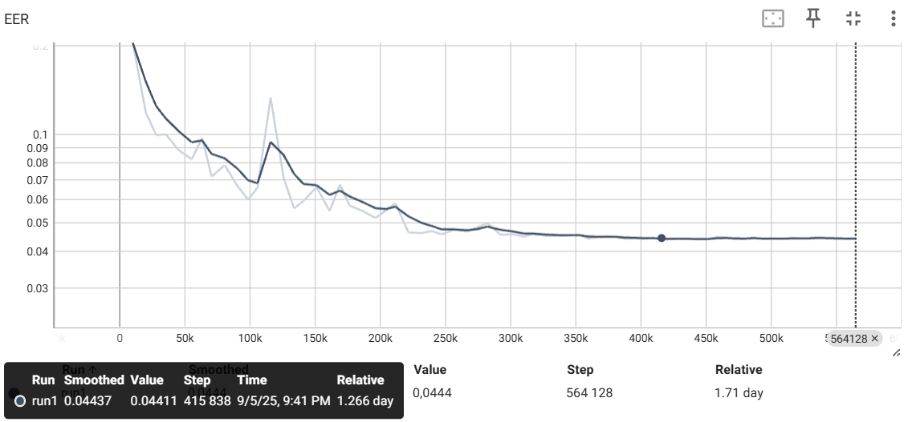

# Speaker Verification Project

An end-to-end pipeline for automatic large-scale speaker verification using VoxCeleb datasets, advanced data augmentation, and state-of-the-art deep learning techniques.

<p align="center">
  <a href="https://huggingface.co/spaces/2pift/Speaker_Verification_Demo">
    
  </a>
</p>

<p align="center">
  <a href="https://huggingface.co/spaces/2pift/Speaker_Verification_Demo">Try it on Hugging Face Spaces</a>
</p>

## Project Overview

The goal of this project was to **reproduce and extend upon state-of-the-art speaker verification methods described in the VoxCeleb papers**. I focused on building a full ML pipeline, including dataset preparation, data augmentation, model design, and custom training workflows.

### Key Steps & Achievements

- **Data Acquisition & Preparation:**  
  - Developed a robust, multithreaded pipeline to automatically download, extract, convert, and validate VoxCeleb1 & VoxCeleb2 datasets (~1.1M audio files, 6112 speakers), using ffmpeg and ThreadPoolExecutor to accelerate processing (reduced prep time from ~40h to 4.5h).
  - Generated validated filelists and metadata as reproducible CSVs, ensuring robust training and preventing data errors.

- **Data Pipeline & Augmentation:**
  - Designed an efficient TensorFlow `tf.data.Dataset` pipeline for on-the-fly batch generation, including spectrogram extraction (512x300, 25ms/10ms windowing), random window selection, channel stacking with delta features and batch/class assignment logic.

- **Model Development & Experimentation:**
  - Started with supervised classification (ResNet50, GlobalAveragePooling, Dense+Softmax, ~27M params).  
  - Reached **val_accuracy of 87%**; initial EER (Equal Error Rate) = 14% after 5 epochs.
  - Developed modular, extensible classes supporting various state-of-the-art loss functions and compared several approaches:
    - **[Contrastive Learning](https://arxiv.org/abs/1503.03832):** Custom pair generation, cosine similarity matrix, custom contrastive loss (inspired by FaceNet, DeepFace, Siamese Networks). Reduced EER to 10%.
    - **Large Margin Cosine Loss ([CosFace](https://arxiv.org/abs/1801.09414)):** Implemented custom CosineLayer and LMCLoss. Reached 9% EER.
    - **Adaptive Cosine Loss ([AdaCos](https://arxiv.org/abs/1905.00292)):** Built AdaCosLoss layer; reached **7.5% EER** with further improvements (BatchNorm layers freezing, etc.).
    - **Lightweight Models:** Evaluated MobileNetV2 (~5M params, EER ~10%) and ResNet18 to enable more frequent training and rapid iteration on my available hardware (Nvidia RTX 3060 GPU), as larger models required long training times.

### Key Takeaways

- **End-to-end ownership:**  
  Responsible for the entire machine learning workflow, including data engineering, software development, model training, and performance analysis.
- **Engineering best practices:**  
  Reproducible pipelines, efficient compute utilization, custom metrics, losses and models, automated result logging, and Hydra configs enabling full experiment reproducibility.
- **Problem-solving:**  
  Identified and resolved bottlenecks in data, model, and training loop. Adapted SOTA techniques and critically assessed their impact on real data.

## Final results

### **Model Performance – Equal Error Rate (EER)**


Baseline results from **VoxCeleb2** paper reported **4.42%** EER with **ResNet-50** and **4.83%** with **ResNet-34** on **VoxCeleb1-E**, and **7.33%** EER with **ResNet-50** on **VoxCeleb1-H**.<br>
My **ResNet-34 achieved 4.41% and 7.72% respectively**.

| Model name                         | Test Set      | EER (%)   | Threshold |
|------------------------------------|---------------|-----------|-----------|
| verification_model_resnet34_512dim | VoxCeleb1-E   | **4.41**  | 0.2468    |
| verification_model_resnet34_512dim | VoxCeleb1-H   | 7.72      | 0.3006    |
| verification_model_resnet18_512dim | VoxCeleb1-E   | **5.50**  | 0.2586    |
| verification_model_resnet18_512dim | VoxCeleb1-H   | 8.65      | 0.3050    |

### EER Curve Plots

Below are the Equal Error Rate plots from two training runs of the ResNet34-based speaker verification model. The EER was measured and logged on-the-fly by a custom callback and visualized in TensorBoard.

**Main Training (2 stages)**

#### Configuration stage 1:
- Optimizer: SGD (`learning_rate=0.01`, `momentum=0.9`, `weight_decay=5e-4`)
- Dynamic LR adjustment: `ReduceLROnPlateau`
- Loss: AdaCosLoss
- 10 training epochs

#### Configuration stage 2:
- Optimizer: SGD (`learning_rate=0.0001`, `momentum=0.9`, `weight_decay=1e-2`)
- Learning Rate Scheduler: LR reduced by a factor of 0.3 after 2 consecutive evaluations without EER improvement.
- BatchNormalization layers frozen, except the one preceding the L2Normalization embedding layer.
- Loss: AdaCosLoss
- 6 training epochs

#### EER plot:


- **ResNet-18**
  - [VoxCeleb1-E](figures/18eer_voxceleb1E.png)
  - [VoxCeleb1-H](figures/18eer_voxceleb1H.png)
- **ResNet-34**
  - [VoxCeleb1-E](figures/34_VoxCeleb1-E.png)
  - [VoxCeleb1-H](figures/34_VoxCeleb1-H.png)

## Quickstart

### 1. **Clone the repository & install requirements**

```sh
git clone https://github.com/yourusername/speaker-verification-project.git
cd speaker-verification-project
pip install -r requirements.txt
```

### 2. **Install FFmpeg**

- **Windows:**
  ```sh
  winget install "FFmpeg (Essentials Build)"
  ```
- **Linux:**
  ```sh
  sudo apt update && sudo apt install ffmpeg
  ```

---

### 3. **Download VoxCeleb dataset**

```sh
python scripts/dataset_download.py \
    --dataset 1 \
    --csv_dir csv \
    --dataset_dir dataset \
    --remove_parts --remove_extracted
```

### 4. **Download a pretrained model**

| Model                                | Base Architecture | File ID (Google Drive)            |
| ------------------------------------ | ----------------- | --------------------------------- |
| verification_model_resnet18_512dim   | ResNet-18         | 18dfDMvbuVP4P_Zf5FI85VSDvmReMmOTk |
| verification_model_resnet34_512dim   | ResNet-34         | 19wtOkYfGg0_g-5GBBGi82nqr-80IlBhd |

```sh
python scripts/model_download.py --file_id 160zM6_4dQY3IlrSaOIkW_bNGenRLqyP0 --output models/pretrained_resnet18.keras
```

### 5. **Convert official test set to CSV**

```sh
python scripts/convert_voxceleb_testset.py \
    --input csv/list_test_hard.txt \
    --dataset_dir dataset \
    --output csv/voxceleb1_test.csv
```

### 6. **Evaluate model**

```sh
python scripts/evaluate.py \
    --model_path models/pretrained_resnet18.keras \
    --test_csv csv/voxceleb1_test.csv \
    --batch_size 8 \
    --output csv/evaluation_output.csv --plot
```

### 7. **Model demo for comparing two audio files**

```sh
python scripts/verify_speaker.py \
    --model models/your_model.keras \
    --rec1 path/to/first_audio.wav \
    --rec2 path/to/second_audio.wav \
    --margin 0.30
```

- `--model` — path to trained Keras model (.keras)
- `--rec1` — first audio file (wav/mp3/m4a...)
- `--rec2` — second audio file (wav/mp3/m4a...)
- `--margin` — (optional) cosine similarity threshold (default: 0.3050)

## Acknowledgements

- The ResNet18 architecture and weights used in this project are based on the [qubvel/classification_models](https://github.com/qubvel/classification_models) repository.

## References

- **VoxCeleb Datasets & Speaker Recognition**
  - [VoxCeleb: A Large-Scale Speaker Identification Dataset](https://arxiv.org/abs/1706.08612)
  - [VoxCeleb2: Deep Speaker Recognition](https://arxiv.org/abs/1806.05622)

- **Contrastive Learning**
  - [FaceNet: A Unified Embedding for Face Recognition and Clustering](https://arxiv.org/abs/1503.03832)
  - [Siamese Neural Networks for One-shot Image Recognition](https://www.cs.cmu.edu/~rsalakhu/papers/oneshot1.pdf)
  - [Dimensionality Reduction by Learning an Invariant Mapping](https://www.cs.nyu.edu/~roweis/papers/chopra-cvpr-2005.pdf)
  - [DeepFace: Closing the Gap to Human-Level Performance in Face Verification](https://www.cs.toronto.edu/~ranzato/publications/taigman-cvpr14.pdf)

- **Large Margin & Adaptive Losses**
  - [CosFace: Large Margin Cosine Loss for Deep Face Recognition](https://arxiv.org/abs/1801.09414)
  - [AdaCos: Adaptively Scaling Cosine Logits for Effectively Learning Deep Face Representations](https://arxiv.org/abs/1905.00292)

## Contact

[LinkedIn](https://www.linkedin.com/in/jakub-muzyk-4906a6111/)

## Hardware

The project was developed and trained on a local machine with the following specifications:

- **CPU**: Intel Core i7-4790 (4 cores, 8 threads, 3.6–4.0 GHz)  
- **RAM**: 15 GB  
- **GPU**: NVIDIA GeForce RTX 3060 Ti (8 GB VRAM, CUDA 12.8)
- **OS**: Ubuntu 22.04